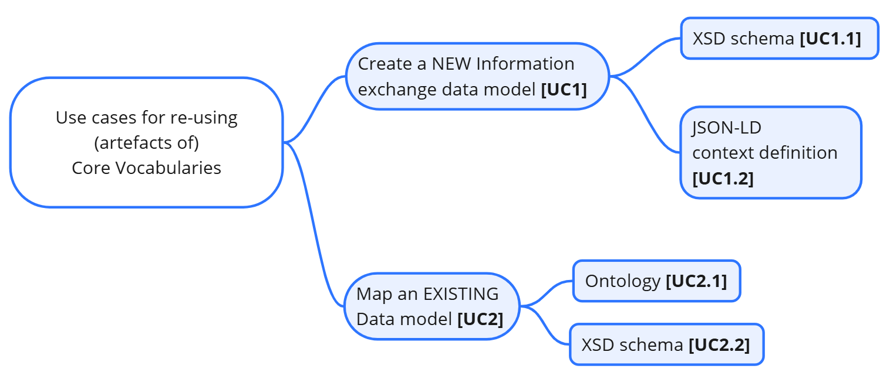
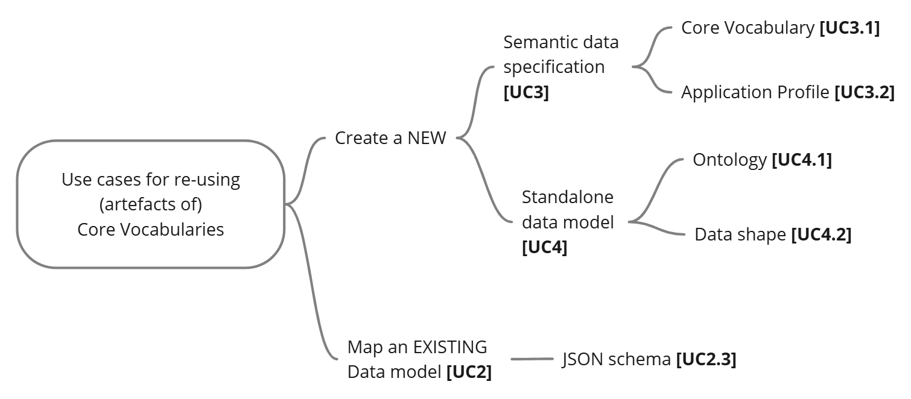

== Use cases

This handbook serves as a practical guide for using Core Vocabularies in various common situations. To provide clear and actionable insights, we have categorized potential use cases into two groups:

- Primary Use Cases: These are the most common, interesting, and/or challenging scenarios, all thoroughly covered within this handbook.
- Additional Use Cases: These briefly introduce other relevant scenarios not elaborated on in detail, for the sake of brevity.

Within both groups, we differentiate between use cases focused on the creation of NEW artefacts and those involving the mapping of EXISTING artefacts to Core Vocabularies.

For a better overview, we numbered the use cases and organised them into two diagrams, followed by the description of these use cases in two separate subsections, one dedicated to the addressed use cases and one to the use cases that are not addressed in this handbook.
// |===
// |*ID*|*Goal*|*Data specification / Artefact*
//
// |UC1|Create a NEW|Information exchange data model
// |UC1.1|Create a NEW|XSD schema
// |UC1.2|Create a NEW|JSON-LD context definition
// |UC2|Map to a Core Vocabulary an EXISTING|Data model
// |UC2.1|Map to a Core Vocabulary an EXISTING|Ontology
// |UC2.2|Map to a Core Vocabulary an EXISTING|XSD schema
// |===
// Table: Listing of addressed use cases

// |===
// |*ID*|*Goal*|*Data specification / Artefact*
//
// |UC3|Create a NEW|Semantic data specification
// |UC3.1|Create a NEW|Core Vocabulary
// |UC3.2|Create a NEW|Application Profile
// |UC4|Create a NEW|Data model
// |UC4.1|Create a NEW|Ontology
// |UC4.2|Create a NEW|Data shape
// |UC2.3|Map to a Core Vocabulary an EXISTING|JSON schema
// |===
// Table: Listing of unaddressed use cases

The use cases provided in this handbook are written in white-box point of style oriented towards user goals[xref:references.adoc#ref:30[weuc]].

We will use the following template to describe the relevant use cases:

|===
|{set:cellbgcolor: #a8c6f7}
*Use Case <UC>: Title of the use case*

|{set:cellbgcolor: #f5f8fc}
*Goal:* A succinct sentence describing the goal of the use case

|*Primary Actor:* The primary actor or actors of this use case

|*Actors:* (Optional) Other actors involved in the use case

|*Description:* Short description of the use case providing relevant information for its understanding

|*Example:* An example to illustrate the application of this use case

|*Note:* (Optional) notes about this use case, especially related to its coverage in this handbook
|===
[[sec:uc1]]
[[sec:addressed-use-cases]]
=== Addressed use cases

|===
|{set:cellbgcolor: #a8c6f7}
*Use Case UC1: Create a new information exchange data model*

|{set:cellbgcolor: #f5f8fc}
*Goal:* Create a new standalone data schema that uses terms from Core Vocabularies.

|*Primary Actors:* Semantic Engineer, Software Engineer

|*Description:* The goal is to design and create a new data schema or information exchange data model that is not part of a more comprehensive semantic data specification, relying on terms from existing CVs as much as possible.

|*Note:* As this is a more generic use case it will be broken down into concrete use cases that focus on specific data formats.
|===

[[sec:uc11]]
|===
|{set:cellbgcolor: #a8c6f7}
*Use Case UC1.1: Create a new XSD schema*

|{set:cellbgcolor: #f5f8fc}
*Goal:* Create a new standalone XSD schema that uses terms from Core Vocabularies.

|*Primary Actors:* Semantic Engineer, Software Engineer

|*Description:* The goal is to design and create a new XSD schema that is not part of a more comprehensive semantic data specification, relying on terms from existing CVs as much as possible. As an information exchange data model, an XSD Schema can be used to create and validate XML data to be exchanged between information systems.

|*Example:* OOTS XML schema mappings [xref:references.adoc#ref:31[oots]]

|*Note:* A detailed methodology to be applied for this use case will be provided in the xref:how-to-create-new-data-models.adoc#sec:create-a-new-xsd-schema[Create a new XSD schema]
|===

[[sec:uc12]]
|===
|{set:cellbgcolor: #a8c6f7}
*Use Case UC1.2: Create a new JSON-LD context definition*

|{set:cellbgcolor: #f5f8fc}
*Goal:* Create a new standalone JSON-LD context definition that uses terms from Core Vocabularies.

|*Primary Actors:* Semantic Engineer, Software Engineer

|*Description:* The goal is to design and create a new JSON-LD context definition that is not part of a more comprehensive semantic data specification, relying on terms from existing CVs as much as possible. As an information exchange data model, a JSON-LD context definition can be integrated in describing data, building APIs, and other operations involved in information exchange.

|*Example:* Core Person Vocabulary [xref:references.adoc#ref:32[cpv-json-ld]], Core Business Vocabulary [xref:references.adoc#ref:33[cbv-json-ld]]

|*Note:* A detailed methodology to be applied for use cases will be provided in the xref:how-to-create-new-data-models.adoc#sec:create-a-new-json-ld-context-definition[Create a new JSON-LD context definition] section.
|===

[[sec:uc2]]
|===
|{set:cellbgcolor: #a8c6f7}
*Use Case UC2: Map an existing data model to a Core Vocabulary*

|{set:cellbgcolor: #f5f8fc}
*Goal:* Create a mapping of an existing (information exchange) data model, to terms from Core Vocabularies.

|*Primary Actors:* Semantic Engineer

|*Actors:* Domain Expert, Software Engineer

|*Description:* The goal is to design and create a mapping of an ontology, vocabulary, or some kind of data schema or information exchange data model that is not part of a more comprehensive semantic data specification, to terms from CVs. Such a mapping can be done at a conceptual level, or formally, e.g. in the form of transformation rules, and most often will include both. +

|*Note:* Since this is a more generic use case it will be broken down into concrete use cases that focus on specific data models and/or data formats. Some of those use cases will be described in detail below, while others will be included in the xref:use-cases.adoc#sec:unaddressed-use-cases[next section], which is dedicated to the unaddressed use cases.
|===

[[sec:uc21]]
|===
|{set:cellbgcolor: #a8c6f7}
*Use Case UC2.1: Map an existing Ontology to a Core Vocabulary*

|{set:cellbgcolor: #f5f8fc}
*Goal:* Create a mapping between the terms of an existing ontology and the terms of Core Vocabularies.

|*Primary Actors:* Semantic Engineer

|*Actors:* Domain Expert, Business Analyst, Software Engineer

|*Description:* The goal is to create a formal mapping expressed in Semantic Web terminology (for example using +rdfs:subClassOf, rdfs:subPropertyOf+, +owl:equivalentClass+, +owl:equivalentProperty, owl:sameAs+ properties), associating the terms in an existing ontology that defines relevant concepts in a given domain, to terms defined in one or more CVs. This activity is usually performed by a semantic engineer based on input received from domain experts and/or business analysts, who can assist with the creation of a conceptual mapping. The conceptual mapping associates the terms in an existing ontology, which defines relevant concepts within a specific  domain, to terms defined in one or more SEMIC Core Vocabularies. The result of the formal mapping can be used later by software engineers to build information exchange systems.

*Example:* Mapping Core Person to Schema.org [xref:references.adoc#ref:34[map-cp2org]], Core Business to Schema.org [xref:references.adoc#ref:35[map-cb2org]], etc.

|*Note:* A detailed methodology to be applied for this use case will be provided in the xref:how-to-map-existing-data-models.adoc#sec:map-an-existing-ontology[Map an existing Ontology] section.
|===

[[sec:uc22]]
|===
|{set:cellbgcolor: #a8c6f7}
*Use Case UC2.2: Map an existing XSD Schema to a Core Vocabulary*

|{set:cellbgcolor: #f5f8fc}
*Goal:* Define the data transformation rules for the mapping of an XSD schema to terms from Core Vocabularies. Create a mapping of XML data that conforms to an existing XSD schema to an RDF representation that conforms to a Core Vocabulary for formal data transformation.

|*Primary Actors:* Semantic Engineer

|*Actors:* Domain Expert, Business Analyst, Software Engineer

|*Description:* The goal is to create a formal mapping using Semantic Web technologies (e.g. RML or other languages), to allow automated translation of XML data conforming to a certain XSD schema, to RDF data expressed in terms defined in one or more SEMIC Core Vocabularies. This use case required definitions of an Application Profile for a Core Vocabulary because the CV alone does not specify sufficient instantiation constraints to be precisely mappable. +
Such activity can be done by semantic engineers based on input from domain experts and/or business analysts, who can assist with the creation of a conceptual mapping. The conceptual mapping is usually used as the basis for the formal mapping. The conceptual mapping can be a simple correspondence table associating the XML Elements defined in an XSD schema, to terms defined in one or more SEMIC Core Vocabularies. In some cases the creation of the conceptual mapping can be done by the semantic engineers themselves, or even by the software engineers building information exchange systems.

|*Example:* ISA2core SAWSDL mapping [xref:references.adoc#ref:36[isa2-map]]
|*Note:* A detailed methodology to be applied for this use case will be provided in the xref:how-to-map-existing-data-models.adoc#sec:map-an-existing-xsd-schema[Map an existing XSD schema] section.
|===

[[sec:unaddressed-use-cases]]
=== Unaddressed use cases

[[sec:uc3]]
|===
|{set:cellbgcolor: #a8c6f7}
*Use Case UC3: Create a new Semantic data specification*

|{set:cellbgcolor: #f5f8fc}
*Goal:* Create a new semantic data specification that reuses terms from Core Vocabularies.

*Primary Actor:* Semantic Engineer

*Description:* The goal is to design and create a semantic data specification that represents the concepts in a particular domain, while reusing terms from existing CVs as much as possible for concepts that are already covered by CVs. Creating semantic data specifications using this approach will support better interoperability.

*Example:* The eProcurement Ontology [xref:references.adoc#ref:37[epo]] is a domain-specific semantic data specification built by reusing terms from multiple Core Vocabularies.

*Note:* Recommendation on how to address this use case can be found in the xref:references.adoc#ref:24[Clarification on “reuse”] section of the SEMIC Style Guide, and therefore will not be addressed in this handbook.
|===
[[sec:uc31]]
|===
|{set:cellbgcolor: #a8c6f7}
*Use Case UC3.1: Create a new Core Vocabulary*

|{set:cellbgcolor: #f5f8fc}
*Goal:* Create a new Core Vocabulary that reuses terms from other Core Vocabularies.

*Primary Actor:* Semantic Engineer

*Description:* The goal is to design and create a new Core Vocabulary that represents the concepts of a generic domain of high potential reusability, while reusing terms from existing CVs as much as possible for concepts that are already covered by those CVs.

*Example:* The Core Business Vocabulary (CBV) [xref:references.adoc#ref:29[cbv]] is built reusing terms from the Core Location Vocabulary (CLV) [xref:references.adoc#ref:38[clv]] and Core Public Organization Vocabulary (CPOV) [xref:references.adoc#ref:39[cpov]].

*Note:* Recommendation on how to address this use case can be found in the xref:references.adoc#ref:24[Clarification on “reuse”] section of the SEMIC Style Guide, and therefore will not be addressed in this handbook.
|===
[[sec:uc32]]
|===
|{set:cellbgcolor: #a8c6f7}
*Use Case UC3.2: Create a new Application Profile*

|{set:cellbgcolor: #f5f8fc}
*Goal:* Create a new Application Profile that reuses terms from other Core Vocabularies and specifies how they should be used.

*Primary Actor:* Semantic Engineer

*Description:* The goal is to design and create a new Application Profile that represents all the concepts and restrictions on those concepts that are relevant in a particular application domain, while reusing terms from existing CVs as much as possible.

*Example:* The Core Public Service Vocabulary Application Profile (CPSV-AP) [xref:references.adoc#ref:40[cpsv-ap]] is built reusing terms from the Core Location Vocabulary (CLV) [xref:references.adoc#ref:38[clv]] and Core Public Organisation Vocabulary (CPOV) [xref:references.adoc#ref:39[cpov]].

*Note:* Recommendation on how to address this use case can be found in the xref:references.adoc#ref:24[Clarification on “reuse”] section of the SEMIC Style Guide, and therefore will not be addressed in this handbook.
|===

[[sec:uc4]]
|===
|{set:cellbgcolor: #a8c6f7}
*Use Case UC4: Create a new data model*

|{set:cellbgcolor: #f5f8fc}
*Goal:* Create a new standalone data model artefact that reuses terms from Core Vocabularies.

*Primary Actor:* Semantic Engineer

*Description:* The goal is to design and create a new data model artefact that is not part of a more comprehensive semantic data specification, describing the concepts that are relevant in a particular domain or application context, while reusing terms from existing CVs as much as possible. Such an artefact can be of different nature both according to their interoperability layer (ranging from vocabulary and ontology, to data shape and data schema) and also according to their abstraction level (ranging from upper layer, through domain layer to application layer).

*Note:* Since this is a more generic use case it will be broken down into more concrete use cases that focus on specific data models. See also some related use cases (UC1, UC1.1 and UC1.2) discussed in the xref:use-cases.adoc#sec:addressed-use-cases[Addressed use cases] section.
|===
[[sec:uc41]]
|===
|{set:cellbgcolor: #a8c6f7}
*Use Case UC4.1: Create a new ontology*

|{set:cellbgcolor: #f5f8fc}
*Goal:* Create a new standalone ontology that reuses terms from Core Vocabularies.

*Primary Actor:* Semantic Engineer

*Description:* The goal is to design and create a new ontology that is not part of a more comprehensive semantic data specification, describing the concepts that are relevant in a particular domain or application context, while reusing terms from existing CVs as much as possible.

*Example:* The eProcurement Ontology (ePO) [xref:references.adoc#ref:37[epo]] is built reusing terms from multiple CVs, including the Core Location Vocabulary (CLV) [xref:references.adoc#ref:38[clv]], Core Public Organisation Vocabulary (CPOV) [xref:references.adoc#ref:39[cpov]] and Core Criterion and Core Evidence Vocabulary (CCCEV) [xref:references.adoc#ref:41[cccev]].

*Note:* Recommendation on how to address this use case can be found in the SEMIC Style Guide (more specifically in the xref:references.adoc#ref:24[Clarification on “reuse”] section and the various xref:references.adoc#ref:42[Guidelines and conventions] subsections), and therefore will not be addressed in this handbook.
|===
[[sec:uc42]]
|===
|{set:cellbgcolor: #a8c6f7}
*Use Case UC4.2: Create a new data shape*

|{set:cellbgcolor: #f5f8fc}
*Goal:* Create a new standalone data shape that specifies restrictions on the use of terms from Core Vocabularies.

*Primary Actor:* Semantic Engineer

*Description:* The goal is to design and create a new data shape that is not part of a more comprehensive semantic data specification, describing the expected use of concepts that are relevant in a particular domain or application context, including the use of terms from existing CVs.

*Note:* Recommendation on how to address this use case can be found in the SEMIC Style Guide (more specifically in the xref:references.adoc#ref:24[Clarification on “reuse”] and xref:references.adoc#ref:43[Data shape conventions] sections), and therefore will not be addressed in this handbook.
|===

[[sec:uc23]]
|===
|{set:cellbgcolor: #a8c6f7}
*Use Case UC2.3: Map an existing JSON Schema to a Core Vocabulary*

|{set:cellbgcolor: #f5f8fc}
*Goal:* Define data transformation rules from an JSON schema to terms from Core Vocabularies. Create a mapping of JSON data that was created according to an existing JSON schema to an RDF representation that conforms to a Core Vocabulary for formal data transformation.

*Primary Actors:* Semantic Engineer

*Actors:* Domain Expert, Business Analyst, Software Engineer

*Description:* The goal is to create a formal mapping using Semantic Web technology (e.g. RML or other languages), to allow automated translation of JSON data conforming to a certain JSON schema, to RDF data expressed in terms defined in one or more SEMIC Core Vocabularies. Such activity can be done by semantic engineers, based on input from domain experts and/or business analysts, who can assist with the creation of a conceptual mapping. The conceptual mapping is usually used as the basis for the formal mapping. The conceptual mapping can be a simple correspondence table associating the JSON data model elements defined in an JSON schema, to terms defined in one or more SEMIC Core Vocabularies. In some cases the creation of the conceptual mapping can be done by the semantic engineers themselves, or even by the software engineers building information exchange systems.
|===

